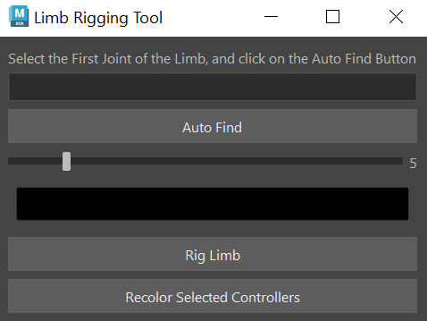
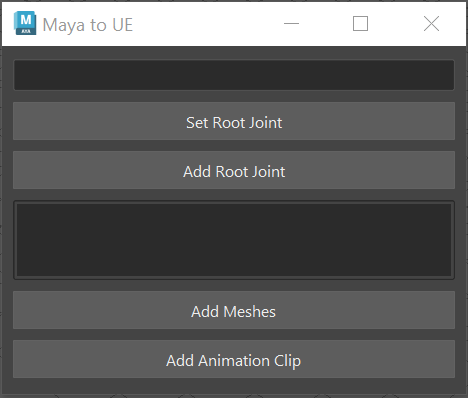

# Maya Plugins

This is a collection of maya plugins to help with rigging and other stuff

## Limb Rigger

Rigs any 3 jointed limb
* Auto find the joints
* Control the controller size
* Control the controller color
* Modular approach
* Can recolor already created controllers

## Maya to Unreal

Meant to prep rig for Unreal Engine
* Sets a root joint
* Add in a root joint if one doesn't exist
* Selecting meshses to export
* Add in multiple animation clips
